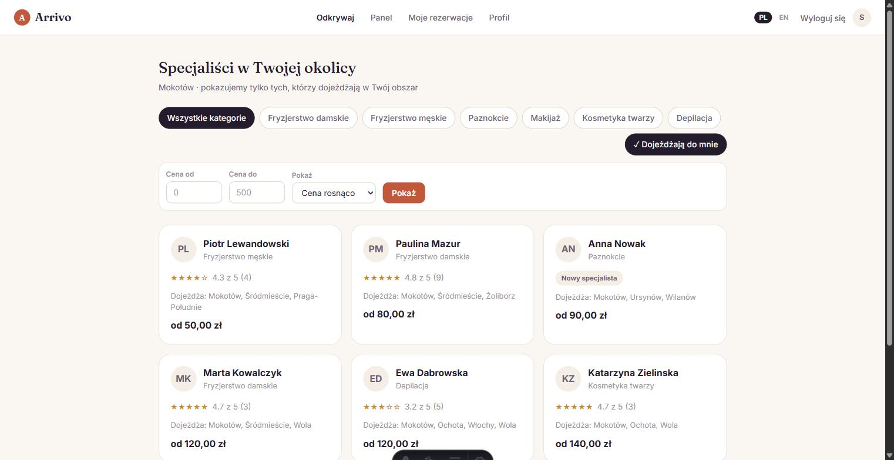
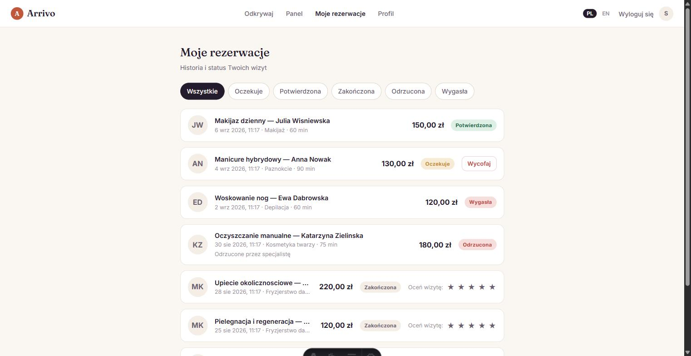

# Arrivo

Marketplace usług fryzjerskich i beauty **z dojazdem do klienta**. Łączy osoby, które nie mogą lub nie chcą jechać do salonu, z niezależnymi specjalistami, którzy przyjeżdżają na miejsce.

**Na żywo:** https://arrivo.dyndalski.workers.dev



## Na czym polega produkt

Regułą, która trzyma całą aplikację, jest to, że **klient widzi wyłącznie specjalistów, których zadeklarowany obszar działania go obejmuje** — opatrzonych oceną zaufania wyliczoną z zakończonych wizyt. Usuń tę regułę, a zostaje kolejna aplikacja do rezerwacji w salonie.

Dwie role:

- **Klient** — zapisuje swój adres, przegląda dopasowanych obszarowo specjalistów, prosi o wizytę u siebie, po jej zakończeniu wystawia ocenę gwiazdkową.
- **Specjalista** — zakłada kartę z zadeklarowanymi dzielnicami i cennikiem usług, przyjmuje lub odrzuca zapytania, oznacza wizyty jako zakończone.

Pełna specyfikacja (persony, FR-001…FR-015, logika biznesowa, kontrola dostępu, non-goals) jest w [`context/foundation/prd.md`](context/foundation/prd.md) i to ona jest źródłem prawdy o zakresie.

### Czego v1 świadomie NIE robi

To są decyzje, nie braki — łatwo je pomylić:

- **Brak płatności.** Klient płaci specjaliście bezpośrednio przy wizycie.
- **Brak czatu.** Koordynację niesie sam przepływ zapytanie → akceptacja.
- **Rezerwacja to prośba, nie kalendarz.** Klient proponuje termin, specjalista go przyjmuje lub nie. Nie ma widoku dostępności.
- **Oceny to same gwiazdki.** Bez treści opinii — moderacja nie miałaby w v1 właściciela.
- **Brak roli administratora.**
- **Nic nie jest publiczne.** Każdy adres aplikacji odbija niezalogowanego na ekran logowania, `/specialists` włącznie. To celowa rozbieżność z pierwotną sekcją Access Control w PRD; poprawka jest w PRD odnotowana.

## Stan

Wszystkie sześć wycinków ze ścieżki must-have jest wdrożonych i zarchiwizowanych:

|      | Wycinek                     | Co daje użytkownikowi                                                                |
| ---- | --------------------------- | ------------------------------------------------------------------------------------ |
| F-01 | fundament ról i prywatności | adres klienta jest nieczytelny dla nikogo, dopóki specjalista nie zaakceptuje wizyty |
| S-01 | konta z rolami              | rejestracja jako klient albo specjalista, logowanie, odzyskiwanie hasła              |
| S-02 | karta specjalisty           | profil z dzielnicami i usługi z cennikiem                                            |
| S-03 | wyszukiwanie po obszarze    | filtrowanie po typie i cenie, ograniczenie do dojeżdżających, podsumowanie ocen      |
| S-04 | zapytanie o wizytę          | prośba o termin u dopasowanego specjalisty                                           |
| S-05 | obsługa zapytań             | akceptacja, odrzucenie, automatyczne wygasanie, oznaczenie jako zakończone           |
| S-06 | oceny i zaufanie            | ocena zakończonej wizyty, średnia na karcie po przekroczeniu progu                   |

Historia i uzasadnienia decyzji każdego wycinka są w [`context/archive/`](context/archive/). Roadmapa: [`context/foundation/roadmap.md`](context/foundation/roadmap.md).

Interfejs jest dwujęzyczny — polski domyślnie, angielski przełącznikiem w nagłówku.



Kontrolka oceny pojawia się tylko przy statusie „Zakończona". Wizyty oczekujące, potwierdzone, odrzucone i wygasłe nie mają gwiazdek, bo FR-013 otwiera ocenianie dopiero wtedy, gdy specjalista oznaczy wizytę jako zakończoną. Ocena jest jednorazowa i trwała — po wysłaniu gwiazdki znikają, a na ich miejscu zostaje to, co przyznano.

## Stack

| Warstwa            | Wybór                                                                                                 |
| ------------------ | ----------------------------------------------------------------------------------------------------- |
| Framework          | [Astro](https://astro.build/) 7 w trybie SSR (`output: "server"`)                                     |
| Wyspy interaktywne | [React](https://react.dev/) 19                                                                        |
| Style              | [Tailwind CSS](https://tailwindcss.com/) 4 + [shadcn/ui](https://ui.shadcn.com/) (wariant „new-york") |
| Typy               | TypeScript 5, walidacja wejścia przez [zod](https://zod.dev/) 4                                       |
| Baza i auth        | [Supabase](https://supabase.com/) — Postgres z RLS, auth na ciasteczkach                              |
| Hosting            | [Cloudflare Workers](https://workers.cloudflare.com/)                                                 |

## Uruchomienie lokalnie

**Wymagania:** Node.js **22.x** (`.nvmrc` przypina 22.14.0 — nowsze wersje główne sypią `EBADENGINE` i nie są wspierane przez toolchain) oraz [Docker](https://www.docker.com/) z ok. 7 GB RAM na lokalny stack Supabase.

```bash
npm install

# 1. Podnieś lokalną bazę (przy pierwszym uruchomieniu pobiera obrazy).
npx supabase start

# 2. Wpisz dane wypisane przez CLI do .dev.vars (dev na Cloudflare) i .env (Node).
cp .env.example .dev.vars
#   SUPABASE_URL=http://127.0.0.1:54321
#   SUPABASE_KEY=<klucz anon z wyjścia CLI>

# 3. Zastosuj migracje i dane demo.
npx supabase db reset

# 4. Start.
npm run dev
```

Aplikacja stoi pod `http://localhost:4321`, Supabase Studio pod `http://localhost:54323`.

`npx supabase db reset` wgrywa też [`supabase/seed.sql`](supabase/seed.sql) — siedmiu specjalistów z usługami, dzielnicami i rozkładem ocen dobranym tak, żeby pokryć każdą gałąź progu zaufania (zero ocen, dwie oceny czyli wciąż poniżej progu, dokładnie trzy, i więcej). Te konta nie mają haseł i nie da się na nie zalogować — istnieją po to, żeby wyszukiwarka miała co pokazać. Załóż własne konto przez `/auth/signup`; potwierdzanie maila jest lokalnie wyłączone w `supabase/config.toml`, więc rejestracja od razu loguje.

## Skrypty

| Polecenie                   | Co robi                                                                             |
| --------------------------- | ----------------------------------------------------------------------------------- |
| `npm run dev`               | serwer deweloperski na runtime **workerd**, nie na zwykłym Node                     |
| `npm run build`             | produkcyjny build SSR                                                               |
| `npm run preview`           | podgląd zbudowanej wersji                                                           |
| `npm run lint` / `lint:fix` | ESLint z regułami wymagającymi typów                                                |
| `npm run check`             | `astro check` — kontrola typów                                                      |
| `npm run format`            | Prettier (wtyczki astro + tailwindcss)                                              |
| `npx astro sync`            | regeneracja typów `astro:env`; uruchom po zmianie `env.schema` w `astro.config.mjs` |

Przed commitem husky + lint-staged same puszczają `eslint --fix` na `*.{ts,tsx,astro}` i `prettier --write` na `*.{json,css,md}`.

## Testy

**Nie ma testowego runnera JavaScript** — żadnego Vitest, żadnego Playwright, żadnego skryptu `test`. Automatyczne pokrycie to **pgTAP przeciwko bazie**, bo to tam mieszkają rzeczy, które naprawdę wymagają przypięcia: polityki RLS, granty i przejścia statusów rezerwacji.

```bash
npx supabase db reset && npx supabase test db ; echo $?
```

**141 asercji w 6 plikach.** Reset przed uruchomieniem to nawyk, nie wymóg — sam zestaw jest idempotentny — ale czerwony wynik na zaśmieconej bazie potrafi wyglądać identycznie jak regresja, więc reset jest uczciwym sposobem przypisania winy. Sprawdzaj **kod wyjścia**, nigdy wynik grepowania po wyjściu (dlaczego: [`context/foundation/lessons.md`](context/foundation/lessons.md)).

Zmiana polityki albo funkcji przejścia powinna przyjść z asercjami w `supabase/tests/database/`.

## Struktura

```
src/
  middleware.ts          # auth na każdym żądaniu; PROTECTED_ROUTES pilnuje dostępu
  pages/                 # trasy Astro (SSR) + endpointy /api
  components/            # Astro do layoutu, React tam gdzie potrzebna interaktywność
    ui/                  # shadcn/ui
  lib/
    supabase.ts          # klient SSR na ciasteczkach (@supabase/ssr)
    routes.ts            # homeFor(role) — jedyne miejsce decydujące o stronie startowej
    schemas/             # schematy zod, jeden moduł na domenę
    services/            # logika biznesowa i mapowanie błędów bazy na typowane wyjątki
    i18n/messages/       # katalogi pl.ts i en.ts
  types.ts               # współdzielone typy encji i DTO
supabase/
  migrations/            # 19 migracji, YYYYMMDDHHmmss_opis.sql
  tests/database/        # zestaw pgTAP
  seed.sql               # dane demo, tylko lokalnie
context/                 # PRD, roadmapa, lekcje, archiwum zamkniętych zmian
```

## Co warto wiedzieć przed pierwszą zmianą

Te rzeczy nie są widoczne z żadnego pojedynczego pliku:

- **Autoryzacja jest w middleware, nie w stronach.** `src/middleware.ts` chodzi przy każdym żądaniu, ustala użytkownika i wiesza go na `context.locals.user`. Żeby zamknąć trasę, dopisz jej ścieżkę do tablicy `PROTECTED_ROUTES` — nie pisz własnych sprawdzeń w stronie.
- **Strona startowa jest zależna od roli i mieszka w jednym miejscu.** `homeFor(role)` w `src/lib/routes.ts` decyduje, gdzie ląduje konto. `/` tylko przekierowuje, `src/pages/index.astro` nic nie renderuje. Nie ma strony marketingowej.
- **Zapisy do bazy idą przez funkcje `SECURITY DEFINER`, nie przez granty INSERT/UPDATE.** Brak grantu _jest_ zabezpieczeniem. Funkcje zgłaszają ustalone kody błędów (`42501` nie twoje, `Z0001` zły status źródłowy, `23505` już istnieje), a warstwa serwisów tłumaczy je na typowane wyjątki niosące klucze katalogu komunikatów.
- **Do Supabase z krawędzi wyłącznie przez HTTP** (`supabase-js` / PostgREST). Nigdy bezpośrednie połączenie Postgresa — Workers nie utrzyma puli TCP na krawędzi i przy współbieżności to sypie się losowo.
- **Każda nowa tabela włącza RLS** z politykami per operacja i per rola. Tabele z danymi osobowymi dostają dodatkowo jawne `revoke all … from service_role` — ta rola ma `BYPASSRLS`, więc polityka jest dla niej niewidoczna, a odebranie uprawnień to jedyna realna granica.
- **Błędy walidacji przekierowują z `?error=<klucz>`** — kluczem katalogu komunikatów, nigdy gotowym zdaniem. Tłumaczy go dopiero strona.
- **Wygasanie rezerwacji robi `pg_cron` co 15 minut wewnątrz Postgresa**, a nie Cron Trigger Cloudflare. Powód jest rozpisany na górze migracji `20260807140000_booking_expiry_cron.sql`: zadanie nie potrzebuje wtedy żadnego klucza do przechowania ani rotacji, a harmonogram jest wersjonowany w migracji zamiast w panelu.

Reguły, które kosztowały już czyjś czas, lądują w [`context/foundation/lessons.md`](context/foundation/lessons.md). Warto tam zajrzeć przed dotknięciem auth, warstwy danych albo migracji.

## Wdrożenie

```bash
npx supabase db push    # migracje na hostowany projekt
npm run build
npx wrangler deploy
```

`SUPABASE_URL` i `SUPABASE_KEY` ustaw jako sekrety Workera (`npx wrangler secret put`). Są **wyłącznie serwerowe** — czytane z `astro:env/server`, nigdy nie trafiają do bundla klienta.

`supabase db push` wysyła tylko migracje. `supabase/seed.sql` nigdy nie trafia na produkcję.

CI (`.github/workflows/ci.yml`) puszcza lint i build przy każdym push i PR na `main`.

## Znane pułapki

- **Pierwszy `npm run dev` potrafi przekroczyć budżet 30 sekund** i paść z „Dev server failed to start within 30s" — workerd musi najpierw zbudować zależności. Uruchom ponownie, kolejne starty są szybkie.
- **`npm run format` to `prettier --write .` bez `.prettierignore`** — przepisze też `context/archive/`, który jest z założenia niezmienny. Formatuj punktowo.
